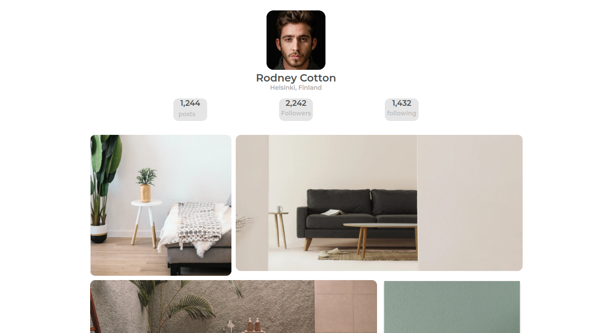

<h1 align="center">Gallery Page</h1>

   Solution for a challenge from  <a href="http://devchallenges.io" target="_blank">Devchallenges.io</a>.

  <h3>
    <a href="https://gallerypage23.netlify.app">
      Demo
    </a>
     | 
    <a href="https://github.com/Queen-codes/Gallery-page">
      Solution
    </a>
     | 
    <a href="https://devchallenges.io/challenges/gcbWLxG6wdennelX7b8I">
      Challenge
    </a>
  </h3>

<!-- TABLE OF CONTENTS -->

## Table of Contents

- [Overview](#overview)
 
- [Contact](#contact)
- [Acknowledgements](#acknowledgements)

<!-- OVERVIEW -->

## Overview

## Features

This application/site was created as a submission to a [DevChallenges](https://devchallenges.io/challenges) challenge. The [challenge](https://devchallenges.io/challenges/gcbWLxG6wdennelX7b8I) was to build an application to complete the given user stories.

## Acknowledgements

<!-- This section should list any articles or add-ons/plugins that helps you to complete the project. This is optional but it will help you in the future. For exmpale -->

- [Steps to replicate a design with only HTML and CSS](https://devchallenges-blogs.web.app/how-to-replicate-design/)
- [MDN](https://developer.mozilla.org/)
- [Marked - a markdown parser](https://github.com/chjj/marked)

## Contact

- Website [GalleryPage](https://gallerypage23.netlify.app)
- GitHub [@Queen-codes](https://github.com/Queen-codes)
- Twitter [@Queen_Islamiat](https://twitter.com/Queen_Islamiat)

